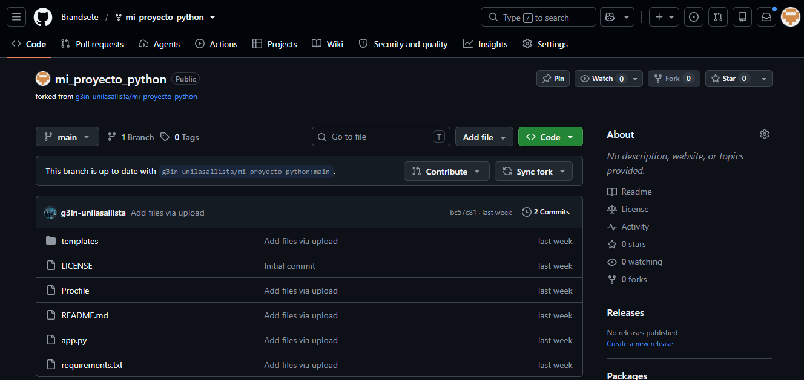
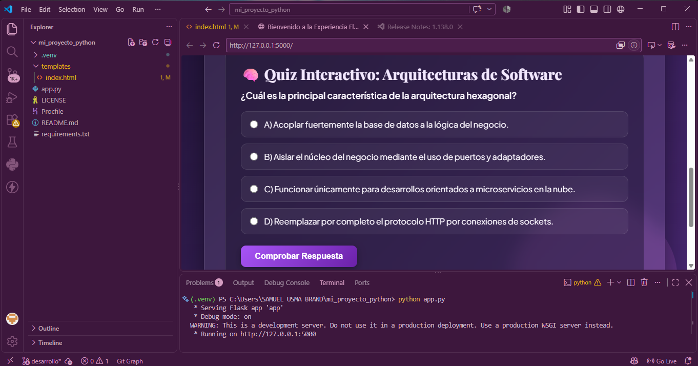
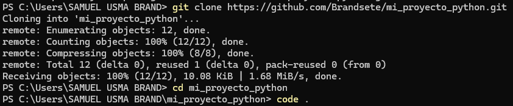
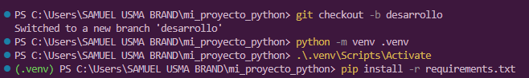

# 💜 Proyecto Flask - Experiencia Web en Tonos Lila


Una aplicación web moderna y elegante construida con **Python** y **Flask**, personalizada con una paleta de colores en **tonos lila, violeta y lavanda**, efectos visuales de cristal esmerilado (*glassmorphism*), tipografía sobria, gráficos vectoriales **SVG** y una sección interactiva de autoevaluación.

---

## 🛠️ Tecnologías Utilizadas

- **Backend**: Python 3, Flask, Gunicorn
- **Frontend**: HTML5, JavaScript (Vanilla ES6), CSS3 (Variables CSS, Flexbox, CSS Grid, Glassmorphism, Micro-animaciones)
- **Recursos**: SVG Vectorial puro, Google Fonts (*Playfair Display* & *Plus Jakarta Sans*)
- **Despliegue**: Render, Git & GitHub

---

## 📝 Respuestas y Análisis Técnico

### Punto 1: Análisis de la Arquitectura del Proyecto y Componentes Principales

**Respuesta y Análisis:**
La arquitectura del proyecto sigue el patrón **MVC (Modelo-Vista-Controlador)** simplificado mediante el microframework Flask:
* **Controlador (`app.py`)**: Centraliza el enrutamiento del servidor de aplicaciones WSGI. Gestiona la recepción de peticiones HTTP en la ruta raíz (`/`) y despacha la representación dinámica de la vista.
* **Vista (`templates/index.html`)**: Define la estructura visual y la experiencia de usuario. Implementa estilos CSS3 embebidos utilizando variables globales para el esquema de colores lila (`#120924`, `#d8b4fe`, `#a855f7`) y manipulación del DOM nativo con JavaScript para validar interactividad en tiempo de ejecución.
* **Gestión de Entorno y Producción**: El aislamiento de dependencias se garantiza mediante un entorno virtual (`.venv`) y la gestión de manifiestos con `requirements.txt`. Para la ejecución en entornos de producción, se desacopla el servidor de desarrollo predeterminado de Werkzeug y se utiliza un servidor WSGI HTTP de alto rendimiento como **Gunicorn**.

---

### Punto 3: Análisis del Quiz Interactivo y Patrón Arquitectónico Evaluado

**Respuesta y Análisis:**
Se integró una sección interactiva de evaluación técnica enfocada en la **Arquitectura Hexagonal (Puertos y Adaptadores)**. 

* **Concepto Evaluado**: La opción correcta (**Opción B**) establece que la función esencial de la Arquitectura Hexagonal es **aislar el núcleo del negocio (*Domain Driven Design*) de la infraestructura tecnológica mediante Puertos (interfaces) y Adaptadores (implementaciones específicas)**.
* **Mecanismo de Validación**: Mediante JavaScript dinámico, la función `evaluarQuiz()` inspecciona los elementos radio dentro del DOM sin realizar recargas de página (*Client-Side Rendering*). Evalúa la opción marcada y aplica feedback visual inmediato modificando clases CSS (`feedback-success` o `feedback-error`).
* **Justificación de Diseño**: Este enfoque minimiza el tráfico de peticiones innecesarias hacia el backend de Flask para validaciones estáticas, garantizando una alta responsividad en el frontend mientras se documentan conceptos clave de diseño de software.

---

### Punto 5: Análisis del Proceso de Despliegue e Infraestructura de Servidor WSGI

**Respuesta y Análisis:**
El despliegue en la plataforma de nube Render requiere una transición formal de un entorno de pruebas a un entorno de producción:

* **Rol de Gunicorn**: El servidor embebido en Flask (`app.run()`) es monohilo y no está optimizado para concurrencia o cargas de producción. **Gunicorn (Green Unicorn)** actúa como un servidor HTTP WSGI basado en un modelo de procesos *pre-fork*, permitiendo procesar múltiples peticiones entrantes de forma paralela, segura y tolerante a fallos.
* **Rol del `Procfile`**: Este archivo actúa como el punto de entrada para el Orquestador PaaS. La instrucción `web: gunicorn app:app` le indica a Render que instancie un proceso web ejecutando el módulo Python `app.py` pasando el objeto de aplicación `app`.
* **Flujo Integrado de CI/CD**: A través de la integración nativa entre GitHub y Render, cada confirmación de cambios (`git push`) desencadena una canalización automática de compilación donde se instalan las dependencias declaradas en `requirements.txt` y se despliega el contenedor actualizado sin interrupción del servicio.

---

## 🖼️ Evidencias del Proyecto

### 🔗 Repositorio del Proyecto
- **GitHub Repository**:(https://github.com/Brandsete/mi_proyecto_python.git)

---

### 📷 Capturas de Pantalla

#### 1. Github clonado



---

#### 2. Servidor Local Ejecutándose



---

#### 3. Codigos para clonar



---

#### 4. Venv y dependencias instaladas



---

#### 5. Despliegue Exitoso en Render

[Despliegue Render](https://mi-proyecto-python-bl7d.onrender.com) 

---

#### 6. Pull request

  

---
## 🚀 Aprende a Replicar este Proyecto

Guía paso a paso para construir la aplicación en tu propia máquina.

### Paso 1: Instalar Python y Git
Asegúrate de tener Python 3.10+ y Git instalados en tu sistema operativo.

```bash
# Verificar la versión de Python
python --version

# Verificar la versión de Git
git --version
